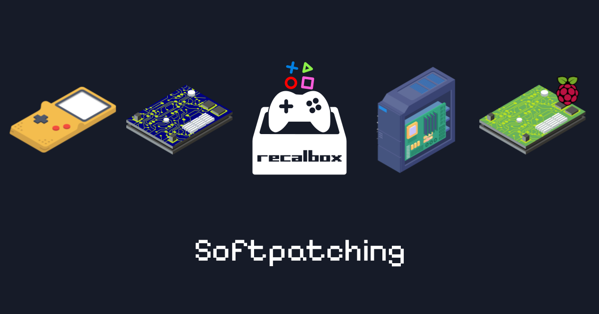

#

## About

### Pack of over than 700 EN/US translation patches for Recalbox's softpatching feature

- To know more about [Recalbox](https://www.recalbox.com/fr/ "recalbox.com")

- To know more about [softpatching](https://wiki.recalbox.com/en/basic-usage/features/softpatching "wiki.recalbox.com")

- Patches collected on [Romhacking.net](https://www.romhacking.net/)

>:heart: Huge thanks to the Recalbox Team, Romhacking.net and all the Authors :heart:

## Download

## How to use

1. **COPY/PAST** each system folder into your **SHARE/ROMS** Recalbox folder.

2. Choose the **SELECT** option in **GAME OPTIONS / SOFTPATCHING**.

3. When you start the game, you will have a message asking you which patch to apply.

4. The joys of discovering all these games, now in English.

## How to read a patch name

- NameoftheGame_language_Autors_version_extra_info (NotG_en_GohanSenior_v1.0_super_pack)

## Patches for

| Systems | Nb Games | tested Cores |
|:--------:|:--------:|:-----------:|
| Famicom Disk System (coming soon) | 45 | Libretro FCEUmm |
| Gameboy | 51 | Libretro Gambatte |
| Gameboy Color | 33 | Libretro Gambatte |
| Gameboy Advance | 23 | Libretro mGBA |
| Master System | 9 | Libretro Gearsystem |
| Mega Drive | 37 | Libretro Picodrive :heavy_exclamation_mark: |
| NEO·GEO Pocket Color | 2 | Libretro Mednafen_WSWAN |
| Nintendo 64 | 7 | Libretro Mupen64Plus NX |
| Nintendo Entertainment System | 308 | Libretro Nestopia :heavy_exclamation_mark: |
| Super Nintendo Entertainment System | 178 | Libretro Snes9x :heavy_exclamation_mark: |
| Satellaview | 11 | Libretro Snes9x |
| WonderSwan | 6 | Libretro Mednafen_WSWAN |
| WonderSwan Color | 6 | Libretro Mednafen_WSWAN |

:heavy_exclamation_mark: Some patches require a different core than the one tested. See the cores.txt for affected patches.

## Comments

- I guarantee the proper launch of all patches with tested cores. But not the bugs that may still exist in the game.

- The “readme.txt” files in each patch folder are for information purposes only.

  :warning: Whatever is requested in the file, no further action is required on your part. :warning:

- I'm available on the [Recalbox Discord](https://discord.gg/GQJREVqrU2) under the nickname **GohanSenior** for any requests or proposals.

## :video_game: Have fun! :round_pushpin:

### GohanSenior
